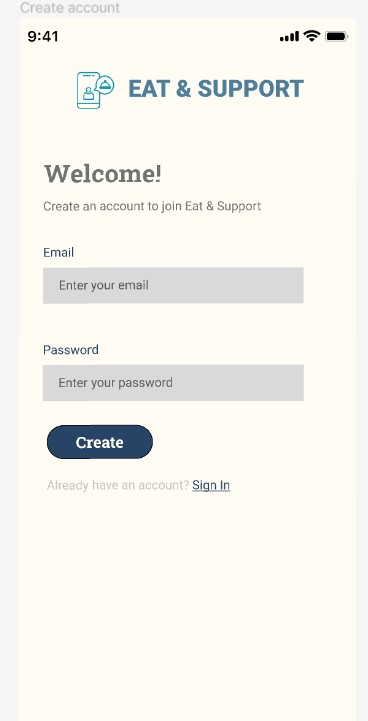
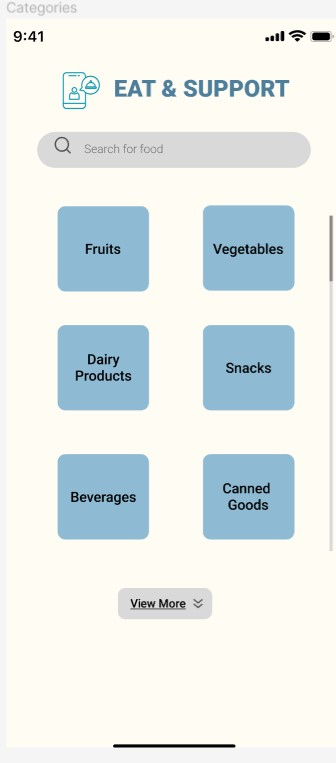

# User story title: User Account and Profile Setup

## Priority: High
Priority given due to the necessity of account management for application functionality and user experience.

## Estimation: 4 days
* Zwe Sett Aung: 4 days (estimated before iteration-1)

## Assumptions (if any):
- Basic user account features are required.
- User authentication is needed for personalized experiences.

## Description: Create a user account system for profile management, preferences, and purchase history enhancing personalized experience.
Description-v1: Setup a system for users to manage their profiles, view purchase history, and set preferences.

## Tasks, see chapter 4.
1. Task 1, Design user database schema, Estimation: 1 day
2. Task 2, Implement user registration and login functionality, Estimation: 2 days
3. Task 3, UI design for account management, Estimation: 1 day

# UI Design:
* Mockup of the user profile and account settings page.

# Completed:
* Screenshots of the completed user account setup interface.

