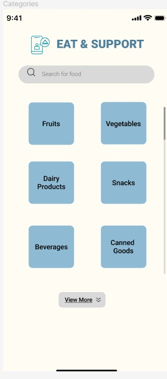
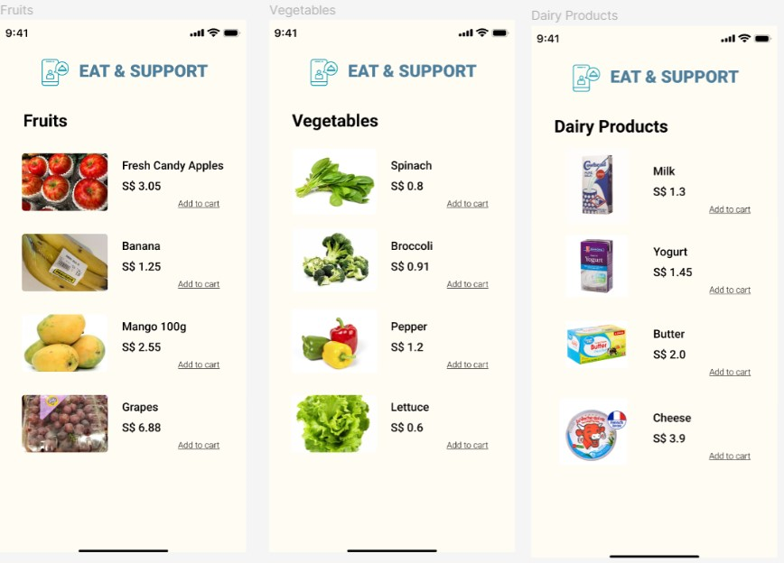

# User story title: Inventory Management for Partners

## Priority: High
Critical for partners to manage their food inventory efficiently.

## Estimation: 4 days
* Zwe Sett Aung: 4 days (estimated before iteration-1)

## Assumptions (if any):
- Partners need a simple interface to add, update, and remove inventory items.

## Description: Implement a straightforward system for partners (restaurants/stores) to list surplus food items, crucial for maintaining up-to-date inventory.
Description-v1: Develop an inventory management system for partners to handle their food items.

## Tasks, see chapter 4.
1. Task 1, Develop backend API for inventory management, Estimation: 2 days
2. Task 2, Create frontend UI for inventory listing and updates, Estimation: 2 days

# UI Design:
* Mockup of the inventory management interface.

# Completed:
* Screenshots of the inventory management interface.
