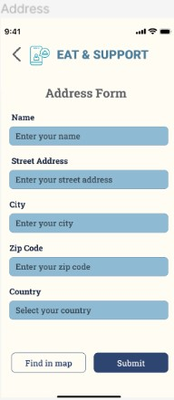
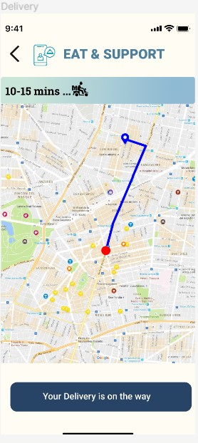

# User story title: Geolocation and Map Integration

## Priority: High
Essential for locating nearby food options, enhancing user convenience.

## Estimation: 5 days
* Zwe Sett Aung: 5 days (estimated before iteration-1)

## Assumptions (if any):
- Access to mobile device location is available.
- Integration with a reliable mapping service.

## Description: Integrate mapping and geolocation to help users locate nearby food options.
Description-v1: Users will be able to find food outlets near them using their mobile devices.

## Tasks, see chapter 4.
1. Task 1, Implement map integration in the app, Estimation: 3 days
2. Task 2, Optimize map loading and interactions, Estimation: 2 days

# UI Design:
* Mockup of the map and location feature.

# Completed:
* Screenshots of the map integration feature.
 