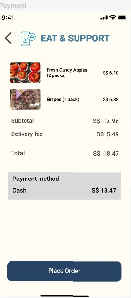

# User story title: Payment Gateway Integration

## Priority: High
Essential for facilitating secure and smooth transactions within the app.

## Estimation: 3 days
* Zwe Sett Aung: 3 days (estimated before iteration-2)

## Assumptions (if any):
- Secure payment gateway API availability.
- Compliance with financial data protection regulations.

## Description: Incorporate a secure payment system for transactions within the app.
Description-v1: Implement a payment module to handle transactions and ensure data security.

## Tasks, see chapter 4.
1. Task 1, Integrate payment gateway API, Estimation: 1.5 days
2. Task 2, Testing and validation of payment functionalities, Estimation: 1.5 days

# UI Design:
* Mockup of the payment process interface.

# Completed:
* Screenshots of the payment integration interface.
 