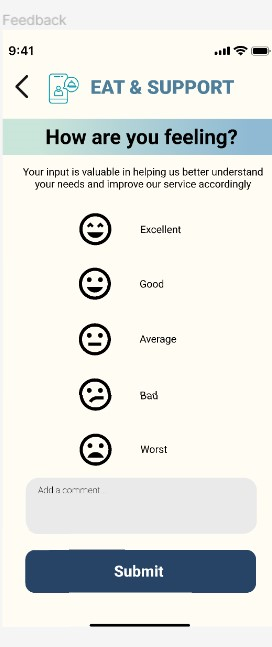

# User story title: Basic User Rating and Feedback System

## Priority: Medium
Important for ensuring service quality and customer satisfaction.

## Estimation: 2 days
* Zwe Sett Aung: 2 days (estimated before iteration-2)

## Assumptions (if any):
- Users will provide feedback after each transaction.
- Feedback is critical for service improvement and customer trust.

## Description: Establish a simple rating and feedback system for users to review their experiences.
Description-v1: Develop a feedback module that allows users to rate and comment on services and products.

## Tasks, see chapter 4.
1. Task 1, Design and implement the feedback interface, Estimation: 1 day
2. Task 2, Integrate feedback system with user profiles and transaction records, Estimation: 1 day

# UI Design:
* Mockup of the user feedback interface.

# Completed:
* Screenshots of the feedback and rating system.
 