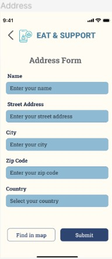

# User story title: Testing and Quality Assurance

## Priority: Medium
Critical to ensure the app's functionality, usability, and security.

## Estimation: 2 days
* Zwe Sett Aung: 2 days (estimated before iteration-2)

## Assumptions (if any):
- Testing covers both automated and manual testing approaches.
- Quality assurance is necessary to move to production.

## Description: Perform thorough testing to ensure app functionality, usability, and security.
Description-v1: Conduct comprehensive tests covering unit, system, and user acceptance testing.

## Tasks, see chapter 4.
1. Task 1, Prepare test cases for all features, Estimation: 1 day
2. Task 2, Execute test scenarios and fix discovered issues, Estimation: 1 day

# UI Design:
* (Not applicable for testing - usually does not involve UI changes)

# Completed:

